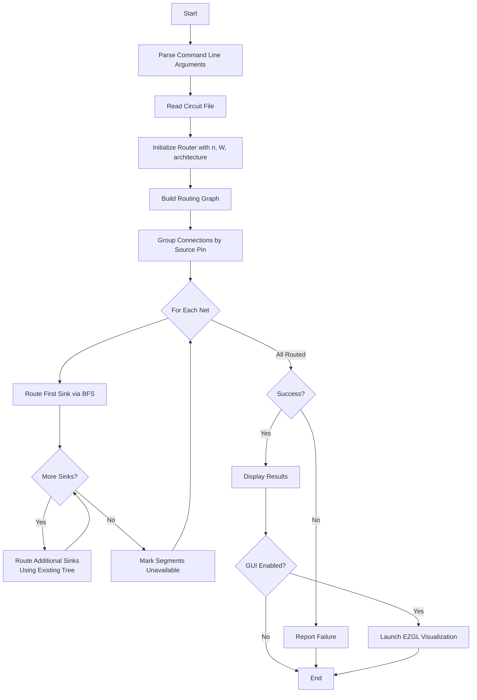
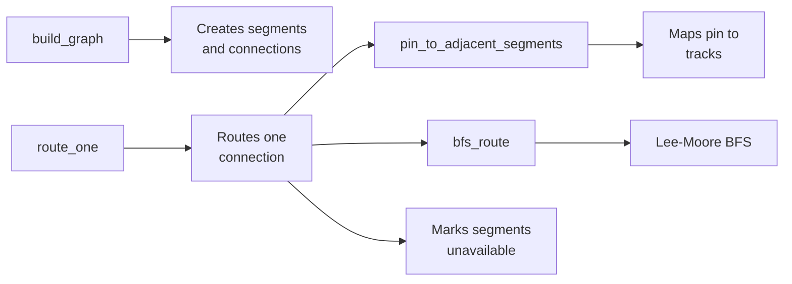

## Q1. Test files plots and segments used

### cct1
- **cct1_distributed**

Used segments = 33
- **cct1_topbottom**

Used segments = 31

### cct2
- **cct2_distributed**

Used segments = 132
- **cct2_topbottom**

Used segments = 130

### cct3
- **cct3_distributed**

Used segments = 703
- **cct3_topbottom**

Used segments = 713

### cct4
- **cct4_distributed**

Used segments = 2368
- **cct4_topbottom**

Used segments = 2375

### Summary

| Test Case | Distributed Segments Used | Top-Bottom Segments Used |
| --------- | ------------------------- | ------------------------ |
| cct1      | 33                        | 31                       |
| cct2      | 132                       | 130                      |
| cct3      | 703                       | 713                      |
| cct4      | 2368                      | 2375                     |

## Q2. Minimum tracks

### cct1 minimum tracks

- **cct1_distributed_min**

W = 3
Used segments = 33

- **cct1_topbottom_min**

W = 3
Used segments = 31

### cct2 minimum tracks

- **cct2_distributed_min**

W = 4
Used segments = 139

- **cct2_topbottom_min**

W = 4
Used segments = 144

### cct3 minimum tracks

- **cct3_distributed_min**

W = 5
Used segments = 712

- **cct3_topbottom_min**

W = 6
Used segments = 717

### cct4 minimum tracks 
- **cct4_distributed_min**

W = 9
Used segments = 2371

- **cct4_topbottom_min**

W = 10
Used segments = 2377

### Minimum Tracks Summary
| Test Case | Distributed |               | Top-Bottom |               |
| --------- | ----------- | ------------- | ---------- | ------------- |
|           | Min W       | Used Segments | Min W      | Used Segments |
| cct1      | 3           | 33            | 3          | 31            |
| cct2      | 4           | 139           | 4          | 144           |
| cct3      | 5           | 712           | 6          | 717           |
| cct4      | 9           | 2371          | 10         | 2377          |

### Optimization Strategies

1. **Fanout Tree Sharing**: Connections are grouped by source pin, so all sinks driven by the same source are routed consecutively. When routing the second and subsequent sinks, the BFS is seeded from both the source pin and all previously-routed segments for that net. This allows different branches of the fanout tree to share common routing segments, reducing overall segment count.

2. **Shortest Path Routing**: The Lee-Moore BFS algorithm finds minimum-length paths between pins, which minimizes the number of segments per connection. The breadth-first expansion guarantees that the first path found is optimal in Manhattan distance.


## Q4. Impact of Pin Placement on Routability

Pin placement architecture significantly impacts routability as circuit complexity increases. For small circuits (cct1, cct2), both architectures achieve the same minimum W, but for larger circuits, distributed pin placement demonstrates clear advantages: 16.7% fewer tracks for cct3 (W=5 vs W=6) and 10% fewer for cct4 (W=9 vs W=10). This occurs because distributing pins across all four sides reduces channel congestion and provides more routing flexibility, while concentrating pins on two sides creates bottlenecks. Segment usage shows the opposite trend: top/bottom uses fewer segments for small circuits but more for large ones, suggesting distributed placement scales better with complexity. The tradeoff is that distributed pins improve routability and scalability at the cost of slightly longer routes in uncongested designs, while top/bottom is more efficient when resources are abundant but struggles under congestion.

## Q5. Parallelization

## Q6. Software Architecture and Design

### High-Level Program Flow



### Major Data Structures

#### Router Class
The `Router` struct encapsulates all routing state and algorithms:

```cpp
struct Router {
    int n, W;                              // Grid size and channel width
    Arch arch;                             // Pin placement architecture
    unordered_map<uint64_t, vector<uint64_t>> adj;  // Segment graph
    unordered_set<uint64_t> unavailable;   // Used segments
    unordered_map<uint64_t, int> segment_to_net;    // Net coloring
};
```

Use 64-bit segment IDs with bit-packing to encode segment properties (horizontal/vertical, row/column, span, track number) in a single integer. This provides O(1) lookups while maintaining a compact representation.

#### Segment ID Encoding
Segments are encoded as 64-bit integers:
- Bit 0: Horizontal (1) or Vertical (0)
- Bits 1-16: Row/Column index
- Bits 17-32: Span index
- Bits 33+: Track number (0 to W-1)

Bit-packing eliminates the need for complex multi-field hash functions and enables fast set/map operations.

#### Graph Representation
The routing resource graph uses an adjacency list:
```cpp
unordered_map<uint64_t, vector<uint64_t>> adj;
```

Adjacency list over adjacency matrix reduces memory from O(V²) to O(V+E), given potentially thousands of segments.

### Major Routines



#### 1. `build_graph()`
Constructs the routing resource graph by creating all horizontal and vertical segments. For each intersection, connects each segment to 3 others: straight-through and two perpendicular turns. Direct adjacency list construction rather than a pattern lookup table clearly encodes the planar topology in code.

#### 2. `pin_to_adjacent_segments(x, y, p)`
Maps a logic block pin to its W adjacent routing tracks (Fc=W).

The critical challenge was determining correct channel-to-block mapping:
- Block at (x,y): LEFT channel at x, RIGHT at x+1, BOTTOM at y, TOP at y+1
- Distributed: Pin 1→LEFT, 2→RIGHT, 3→TOP, 4→BOTTOM
- Top/Bottom: Pins 1,2→TOP, Pins 3,4→BOTTOM

This required careful analysis as "TOP of block y" corresponds to channel y+1, not y.

#### 3. `bfs_route(src_seed, tgt_adj)`
Implements multi-source Lee-Moore BFS:

Multi-source initialization enables fanout tree routing. For nets with multiple sinks, subsequent BFS starts from both the source pin AND previously-routed segments, allowing natural tree sharing.

**Algorithm**:
1. Initialize queue with all source segments
2. Expand wave-front, tracking parents
3. Stop when target reached
4. Backtrace to construct path

#### 4. `route_one(source, sink, existing_tree)`
Routes a single source-sink connection.

The `existing_tree` parameter enables fanout optimization. When routing subsequent sinks of a multi-terminal net, the existing tree is included in the BFS seed, automatically creating shared routing trees and reducing segment usage.

#### 5. Visualization

The GUI uses color-coding to associate pins with their routes. Each net gets a unique color (cycling through 8 colors), and both routing segments and endpoint pins use matching colors for easy verification. This visual mapping makes routing correctness immediately apparent and helps debug pin placement issues.