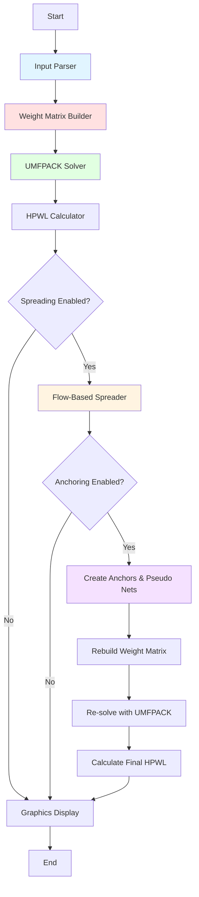

# ECE1387 Assignment 2 Report

## Analytical Placement and Flow-Based Spreading with Heterogeneous Cells

Lang Sun
1003584971

## Part 1

- cct1 ap

- cct2 ap

- cct3 ap

| Input | Total HPWL |
| ----- | ---------- |
| cct1  | 1238.85    |
| cct2  | 17056.50   |
| cct3  | 12610.27   |

## Part 2

### i)

For finding the optimal Psi initial value and Psi increment value, I did a sweep of diffferent combinations of Psi initial value and Psi increment value on all three cct and plot the Psi_init/Psi_incr vs Displacement and the Psi_init/Psi_incr vs iterations of convergence graphs. For deatailed result data, the original csv files are included in the assignment_2 folder.

- cct2 homogeneous

- cct2 heterogeneous

- cct3 homogeneous

- cct3 heterogeneous

From the graphs, it shows that for all cases, a smaller Psi initial value and a smaller Psi increment value generally leads to smaller displacement but more iterations, which means they might not converge in the given maximum number of iterations (in this case max 100 iterations). So a small value of Psi initial value and Psi increment value while still converging within the maximum number of iterations is preferred. **Base on the sweep result, the smallest displacement combination is selected as the optimal value for the 2ii part**

The optimal values selected are as follows:

| input | achitecture   | Psi_init | Psi_incr | displacement | iterations | HPWL before spreading | HPWL after spreading |
| ----- | ------------- | -------- | -------- | ------------ | ---------- | --------------------- | -------------------- |
| cct2  | homogeneous   | 0.50     | 0.25     | 3512.0       | 46         | 17056.50              | 29659.3 (+73.9%)     |
| cct2  | heterogeneous | 2.00     | 0.25     | 3510.0       | 42         | 17056.50              | 29768.5 (+74.5%)     |
| cct3  | homogeneous   | 0.50     | 0.25     | 11928.0      | 66         | 12610.3               | 14537.5 (+15.3%)     |
| cct3  | heterogeneous | 0.50     | 0.25     | 11961.0      | 67         | 12610.3               | 14561.6 (+15.5%)     |

For different type of architecture, add a arg -s and flag in logic to select different architecture. In homogeneous mode, all cells can be placed in any bin. In heterogeneous mode, add a check during bin selection to enforce the column restrictions. Before moving a cell to a bin, verify that Type 0 cells only go to columns where `col % 4 ∈ {0, 1, 2}` and Type 1 cells only go to columns where `col % 4 = 3` like instructed. So if first candidate bin does not satisfy the condition, skip to next candidate bin until a valid one is found.

### ii)

weak = anchor weight 0.1
strong = anchor weight 100

- cct2 homogeneous weak

After analytical placement: 17056.500
After spreading:            29659.274
After anchoring & re-solve: 20595.975

Change from spreading:      +12602.773 (+73.888%)
Change from anchoring:      -9063.299 (-30.558%)
Total change:               +3539.474 (+20.751%)

- cct2 homogeneous strong

After analytical placement: 17056.500
After spreading:            29659.274
After anchoring & re-solve: 28223.301

Change from spreading:      +12602.773 (+73.888%)
Change from anchoring:      -1435.973 (-4.842%)
Total change:               +11166.800 (+65.469%)

- cct2 heterogeneous weak

After analytical placement: 17056.500
After spreading:            29768.454
After anchoring & re-solve: 20593.453

Change from spreading:      +12711.954 (+74.528%)
Change from anchoring:      -9175.001 (-30.821%)
Total change:               +3536.953 (+20.737%)

- cct2 heterogeneous strong

After analytical placement: 17056.500
After spreading:            29768.454
After anchoring & re-solve: 28286.256

Change from spreading:      +12711.954 (+74.528%)
Change from anchoring:      -1482.198 (-4.979%)
Total change:               +11229.756 (+65.839%)

- cct3 homogeneous weak

After analytical placement: 12610.273
After spreading:            14537.479
After anchoring & re-solve: 24450.685

Change from spreading:      +1927.205 (+15.283%)
Change from anchoring:      +9913.206 (+68.191%)
Total change:               +11840.411 (+93.895%)

- cct3 homogeneous strong

After analytical placement: 12610.273
After spreading:            14537.479
After anchoring & re-solve: 15596.314

Change from spreading:      +1927.205 (+15.283%)
Change from anchoring:      +1058.835 (+7.283%)
Total change:               +2986.040 (+23.679%)

- cct3 heterogeneous weak

After analytical placement: 12610.273
After spreading:            14561.605
After anchoring & re-solve: 24483.727

Change from spreading:      +1951.331 (+15.474%)
Change from anchoring:      +9922.123 (+68.139%)
Total change:               +11873.454 (+94.157%)

- cct3 heterogeneous strong

After analytical placement: 12610.273
After spreading:            14561.605
After anchoring & re-solve: 15615.693

Change from spreading:      +1951.331 (+15.474%)
Change from anchoring:      +1054.089 (+7.239%)
Total change:               +3005.420 (+23.833%)

#### Summary

**Weak Anchors (0.1):**
- **cct2**: HPWL decreases ~30% (29,700 → 20,600) as cells collapse back toward AP center to minimize wirelength. Real nets dominate over weak anchors.
- **cct3**: HPWL increases ~68% (14,550 → 24,450). Since spreading only increased HPWL by 15%, weak anchors create a poor compromise worse than either extreme.

**Strong Anchors (100):**
- **cct2**: HPWL stays high with only 5% decrease. Anchors successfully pin cells at spread positions.
- **cct3**: HPWL increases only 7%. Cells remain spread as anchors dominate real nets.

**Trade-off:** Weak anchors allow wirelength optimization but introduce overlaps. Strong anchors maintain overlap-free placement at the cost of higher HPWL.

**Homogeneous vs. Heterogeneous:** Minimal difference (~0.1-0.5% HPWL variation). Column restrictions don't significantly affect anchoring behavior.

## Program Flow

## Module Descriptions

**Input Parser (`input_parser.cpp`):**
Reads the circuit netlist file and populates the global data structures with blocks (cells) and nets. Parses moveable blocks, fixed I/O pads, and connectivity information. Validates input format and reports circuit statistics.

**Weight Matrix Builder (`weight_matrix.cpp`):**
Constructs the sparse Q matrix and b vectors for the linear system Qx=b using the clique model. For each net, adds edge weights between all pairs of connected blocks. Handles fixed blocks by moving their contributions to the b vector.

**UMFPACK Solver (`umfpack_solver.cpp`):**
Solves the analytical placement linear system using UMFPACK sparse direct solver. Performs symbolic factorization, numeric factorization, and solves for both X and Y coordinates. Updates block positions with the computed optimal locations.

**HPWL Calculator (`hpwl_calculator.cpp`):**
Computes the half-perimeter wirelength for all nets by finding bounding boxes. For each net, calculates (max_x - min_x) + (max_y - min_y) across all connected blocks. Provides total HPWL and per-net statistics.

**Flow-Based Spreader (`spreader.cpp`):**
Implements the iterative spreading algorithm to eliminate overlaps. Bins the placement area into a 40×40 grid, identifies overcapacity bins, and moves cells to nearby bins with available capacity using flow paths constrained by ψ (maximum movement distance). Increases ψ each iteration until zero overlaps achieved.

**Anchoring System (`spreader.cpp`):**
Creates artificial fixed anchor blocks at each cell's spread position and connects them via two-pin pseudo nets. Scales pseudo net weights by the anchor_weight parameter to control the strength of attraction. Forces weight matrix rebuild and re-solve to balance wirelength optimization with overlap prevention.

**Graphics Display (`graphics.cpp`):**
Visualizes the final placement using EZGL library. Draws blocks as colored rectangles (different colors for types), shows fixed I/O pads, and displays nets as lines. Provides interactive zooming and panning for visual inspection of placement quality.
