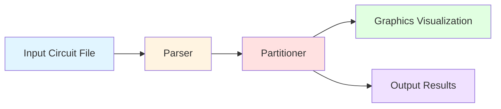

# ECE1387 - Assignment 3 Report

Lang Sun
1003584971

### Program Flow Overview



The program consists of three main components:

1. **Parser**: Reads circuit file and constructs data structures
2. **Partitioner**: Performs branch-and-bound search to find optimal bipartition
3. **Graphics**: Visualizes the decision tree (optional)

## 1.a Branching Structure (Decision Tree Design)

Baswically what we are introduced in the lecture with some optimizations I tested that works. The partitioner uses a binary decision tree where each node represents assigning one block to either LEFT or RIGHT partition:

**Basic Structure:**
- Each level assigns one block
- Two children per node: LEFT branch (assign to left side), RIGHT branch (assign to right side)
- Depth-first search with backtracking
- Prune branches when lower bound ≥ current best cost

**Pruning Conditions:**
1. Balance constraint: Each partition must have exactly n/2 blocks. Prune if impossible to balance.
2. Lower bound check: If minimum possible cost ≥ current best, prune this branch.

**Some Design Decisions:**

Block Assignment Order:
- Blocks are sorted by fanout (number of connected nets) in descending order
- High-connectivity blocks are decided first at shallow tree levels
- This enables better pruning early since high-impact blocks affect more nets

Community-first Branching:
- Before branching, check if the current block has community partners already assigned
- Try the side with partners first (keeps communities together when possible)
- Branch order: if partner on LEFT → try LEFT first, then RIGHT; if partner on RIGHT → try RIGHT first, then LEFT

### Some Optimizations that works:

#### 1: Block Ordering by Fanout
- Sort blocks by number of connected nets (fanout), highest first
- High-connectivity blocks affect more nets → larger impact on total cost
- Logic: 
  - deciding high-impact blocks early constrains more nets
  - better lower bounds at shallow depths → more aggressive pruning
- `std::sort()` on blocks by `circuit.block_to_nets[blk].size()`
- 
#### 2: Community-Aware Branching
- Check community partners before branching; try keeping them together first
- Community pairs have penalty if split → preferring same side finds better solutions faster
- Logic:
  - for each block, check if it has partners in `circuit.community_pairs`
  - if partner already assigned to LEFT → set `first_side = LEFT` (try this first)
  - if partner already assigned to RIGHT → set `first_side = RIGHT`
  - this doesn't guarantee keeping them together (still explores both sides) but finds good solutions earlier
- Loop through `community_map[blk]` before branching

#### 3: Incremental Cost Calculation
- Only recalculate cost for nets connected to newly assigned block
- Full partition cost calculation is O(nets × blocks) - way too slow
- Logic:
  - when assigning block B, only nets connected to B can change their cut status
  - for each net touching B: check if it now crosses the cut (has blocks on both sides)
  - add crossing penalty (+1) if it newly crosses; add community penalty if partner split
  - reduces cost calculation from O(all nets) to O(nets connected to current block)
- `compute_additional_cost()` only examines `circuit.block_to_nets[blk]`

#### 4: Better Initial Upper Bound (Greedy Solution)
- Start with a good partition found by greedy algorithm, not INT_MAX
- Better initial `best_cost` → more branches pruned early
- Logic:
  - greedy algorithm assigns blocks one-by-one, choosing side with fewer crossing nets
  - balances both sides while minimizing cuts
-  `find_initial_solution()` before starting B&B

#### 5: Balance-Constraint Prediction (Tighter Lower Bound)
- Predict future cuts that will be forced by partition balance requirements
- Standard lower bound only counts nets already cut; prediction looks ahead
- Logic:
  - calculate remaining space: `spaces_left = n/2 - left_count`, `spaces_right = n/2 - right_count`
  - net prediction: For each net with blocks only on LEFT + unassigned blocks:
    - if `unassigned > spaces_left` → at least one MUST go RIGHT → guaranteed future cut
    - same logic for nets with blocks only on RIGHT
  - community prediction: For community pairs with one assigned, one unassigned:
    - if assigned block on LEFT but `spaces_left = 0` → partner MUST go RIGHT → guaranteed split
    - same for RIGHT side
  - add these guaranteed future cuts to current lower bound
- `compute_balance_predicted_cuts()` called before pruning check

#### 6: Multithreading (Parallel Branch-and-Bound)
- Split search space across multiple threads with shared best cost
- cct4 takes minutes sequentially; parallelism exploits multi-core CPUs
- Logic:
  - pre-assign first log₂(T) blocks to create T independent subproblems
  - example: 8 threads → pre-assign first 3 blocks → 2³ = 8 unique starting states
  - each thread runs B&B on its subproblem starting from depth 3
  - shared atomic `best_cost` enables cross-thread pruning:
    - when thread A finds better solution → updates shared `best_cost`
    - thread B can immediately prune based on A's improvement
  - parallel node exploration sometimes finds better paths faster
-  Parallel threads with atomic operations, mutex for result updates

## 1.b

A greedy algorithm is used to find an initial upper bound before starting branch-and-bound:

1. Sort blocks by fanout (same as B&B ordering)
2. For each block in order:
   - Count how many of its connected nets are already on LEFT vs RIGHT
   - Assign block to the side with fewer connections (minimizes new cuts)
   - Respect balance constraint: if one side is full, assign to other side
3. Calculate total cost of this greedy partition

- Greedy produces a valid balanced partition quickly
- Much better than starting from infinity (INT_MAX)

## 1.c

A two part lower bound is used that becomes tighter as the search descends the tree:

1: Current Lower Bound (Nets Already Cut)
- Count nets that currently cross the partition
- A net crosses if it has blocks assigned to both LEFT and RIGHT
- Formula: `current_lb = count(nets with blocks on both sides) + community_penalties`
- This is an exact count of committed cuts, not a bound

2: Balance-Constraint Prediction (Future Forced Cuts)
- Predict cuts that will be forced by partition balance requirements
- Implemented in `compute_balance_predicted_cuts()`

Net Prediction:
```
For each net N:
  - Count blocks on LEFT, RIGHT, and UNASSIGNED
  - If net has blocks only on LEFT + some unassigned:
      remaining_space_left = n/2 - left_count
      If unassigned > remaining_space_left:
        → At least one unassigned MUST go RIGHT
        → Net will be cut (guaranteed)
        → Add 1 to predicted_cuts
  - Same logic for nets with blocks only on RIGHT
```

Community Prediction:
```
For each community pair (A, B):
  - If A assigned to LEFT, B unassigned:
      If spaces_left = 0:
        → B MUST go RIGHT (no room on LEFT)
        → Community will be split (guaranteed)
        → Add 1 to predicted_cuts
  - Same for A on RIGHT, and symmetric cases
```

Total Lower Bound:
```
lower_bound = current_lb + predicted_cuts
```

Pruning Decision:
```
if (lower_bound >= best_cost):
    prune this branch  // Cannot possibly beat current best
```

- `current_lb` counts cuts already committed to
- `predicted_cuts` counts cuts !guaranteed! to occur due to balance constraints
- Together they form a valid lower bound (never underestimates true cost)
- Tighter bound → more aggressive pruning → fewer nodes explored

## 2.a
- cct1 graph

- cct2 graph

- cct3 graph

- cct4 graph

##  Full Results
| Index | Total Cost | Crossing Cost | Community Cost | Nodes Visited | Runtime (ms) | Runtime (s) | Circuit | Threads |
| ----- | ---------- | ------------- | -------------- | ------------- | ------------ | ----------- | ------- | ------- |
| 0     | 10         | 10            | 0              | 33            | 0            | 0.000       | cct1    | 1       |
| 1     | 10         | 10            | 0              | 46            | 1            | 0.001       | cct1    | 2       |
| 2     | 10         | 10            | 0              | 30            | 2            | 0.002       | cct1    | 4       |
| 3     | 10         | 10            | 0              | 28            | 2            | 0.002       | cct1    | 8       |
| 4     | 10         | 10            | 0              | 28            | 2            | 0.002       | cct1    | 16      |
| 5     | 10         | 10            | 0              | 42            | 5            | 0.005       | cct1    | 32      |
| 6     | 10         | 10            | 0              | 70            | 3            | 0.003       | cct1    | 64      |
| 7     | 10         | 10            | 0              | 132           | 8            | 0.008       | cct1    | 128     |
| 8     | 14         | 14            | 0              | 13639         | 13           | 0.013       | cct2    | 1       |
| 9     | 14         | 14            | 0              | 24280         | 25           | 0.025       | cct2    | 2       |
| 10    | 14         | 14            | 0              | 41280         | 20           | 0.020       | cct2    | 4       |
| 11    | 14         | 14            | 0              | 37378         | 17           | 0.017       | cct2    | 8       |
| 12    | 14         | 14            | 0              | 17128         | 6            | 0.006       | cct2    | 16      |
| 13    | 14         | 14            | 0              | 21982         | 6            | 0.006       | cct2    | 32      |
| 14    | 14         | 14            | 0              | 21698         | 10           | 0.010       | cct2    | 64      |
| 15    | 14         | 14            | 0              | 9270          | 9            | 0.009       | cct2    | 128     |
| 16    | 21         | 21            | 0              | 66203         | 99           | 0.099       | cct3    | 1       |
| 17    | 21         | 21            | 0              | 49400         | 60           | 0.060       | cct3    | 2       |
| 18    | 21         | 21            | 0              | 63716         | 48           | 0.048       | cct3    | 4       |
| 19    | 21         | 21            | 0              | 80220         | 41           | 0.041       | cct3    | 8       |
| 20    | 21         | 21            | 0              | 57414         | 29           | 0.029       | cct3    | 16      |
| 21    | 21         | 21            | 0              | 42348         | 23           | 0.023       | cct3    | 32      |
| 22    | 21         | 21            | 0              | 46408         | 20           | 0.020       | cct3    | 64      |
| 23    | 21         | 21            | 0              | 43862         | 18           | 0.018       | cct3    | 128     |
| 24    | 62         | 62            | 0              | 76773195      | 184068       | 184.068     | cct4    | 1       |
| 25    | 62         | 62            | 0              | 78006516      | 112047       | 112.047     | cct4    | 2       |
| 26    | 62         | 62            | 0              | 79094418      | 92213        | 92.213      | cct4    | 4       |
| 27    | 62         | 62            | 0              | 78815074      | 62491        | 62.491      | cct4    | 8       |
| 28    | 62         | 62            | 0              | 82087604      | 43757        | 43.757      | cct4    | 16      |
| 29    | 62         | 62            | 0              | 88890504      | 30735        | 30.735      | cct4    | 32      |
| 30    | 62         | 62            | 0              | 99322988      | 22539        | 22.539      | cct4    | 64      |
| 31    | 62         | 62            | 0              | 103565696     | 18282        | 18.282      | cct4    | 128     |
## 2.b


| circuit | threads | lowest visited nodes |
| ------- | ------- | -------------------- |
| cct1    | 8/16    | 28                   |
| cct2    | 1       | 13639                |
| cct3    | 2       | 49400                |
| cct4    | 1       | 76773195             |

- more threads help to reduce runtime but may increase the number of visited nodes as overhead will be created in managing threads.

## 2.c


| circuit | threads | lowest runtime (s) |
| ------- | ------- | ------------------ |
| cct1    | 1       | 0.000              |
| cct2    | 16/32   | 0.006              |
| cct3    | 128     | 0.018              |
| cct4    | 128     | 18.282             |

- more threads help to reduce runtime significantly, especially for larger circuits.
 PS: I tried to run cct4 with 128 threads on ECF server, after hoging 100% the CPU, it completes in 18.282s, compared to 184.068s with single thread, that's 10x speedup! multithreading matches with this problme well.

## 2.d

| circuit | total cost | crossing count | community cost |
| ------- | ---------- | -------------- | -------------- |
| cct1    | 10         | 10             | 0              |
| cct2    | 14         | 14             | 0              |
| cct3    | 21         | 21             | 0              |
| cct4    | 62         | 62             | 0              |

## 3

Community block pairs increase problem complexity by adding a second objective (minimize community splits) that can conflict with net cut minimization. This expands the search space as the algorithm must balance both objectives. To handle this, community pairs are built into the bounding function in two ways: (1) counting already-split communities in the current lower bound, and (2) predicting forced future splits due to balance constraints in the balance-prediction component. Two optimizations specifically address community pairs: community-aware branching (optimization 2) heuristically tries to keep pairs together when branching to find good solutions faster, and balance-constraint prediction (optimization 5) tightens the lower bound by predicting unavoidable community splits, enabling earlier pruning.