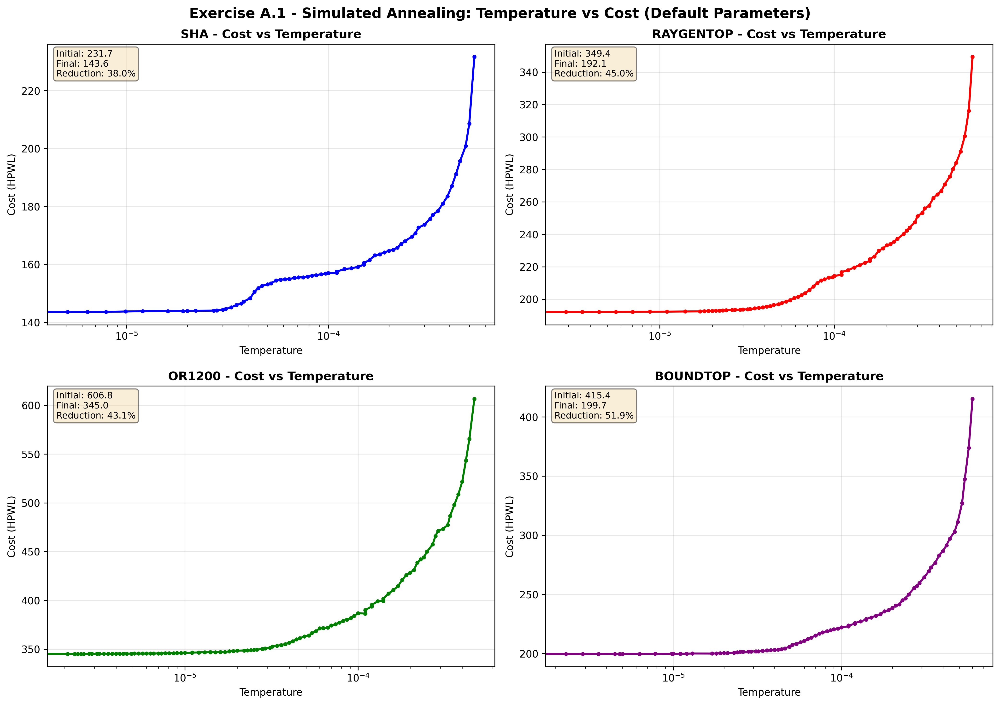
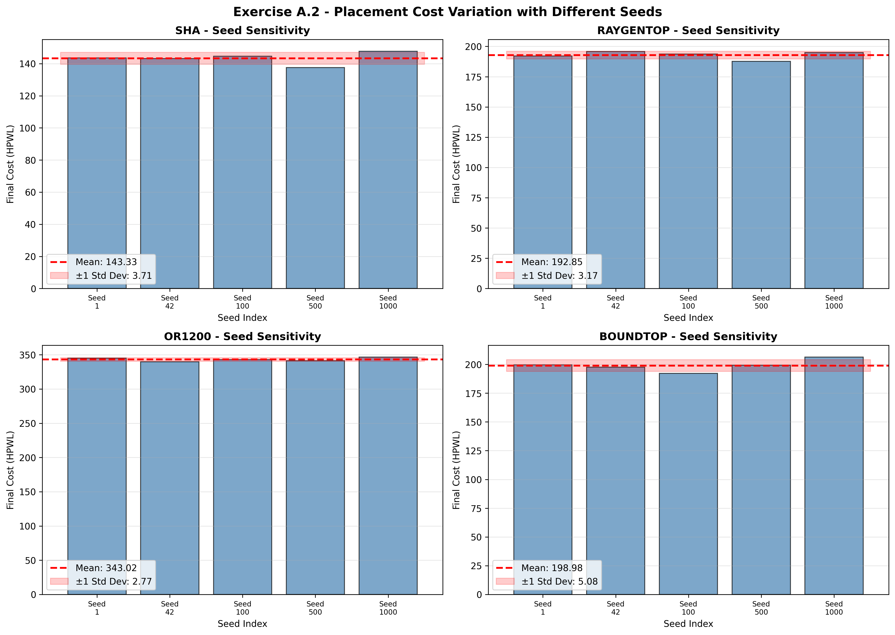
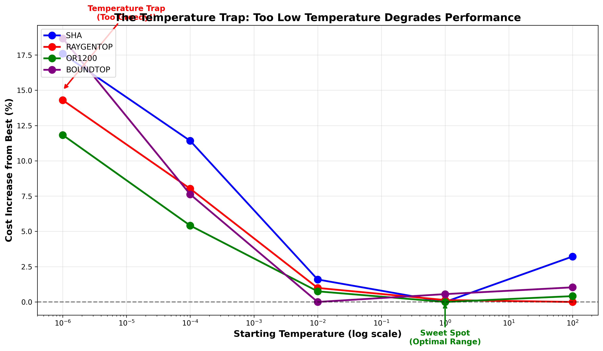
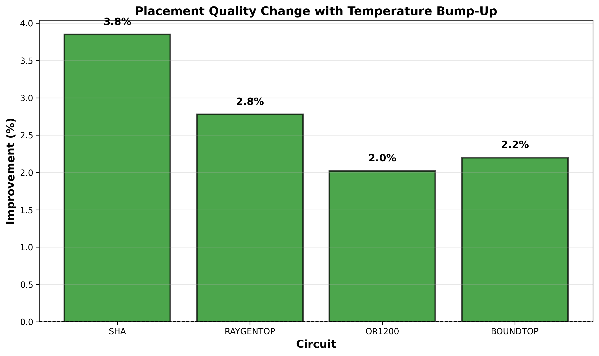
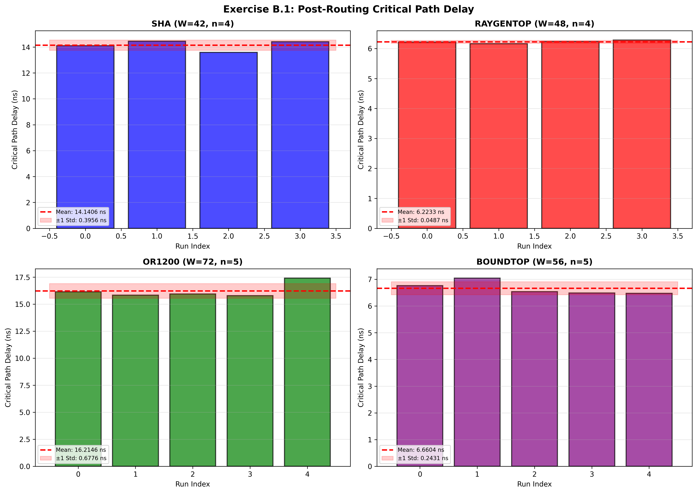
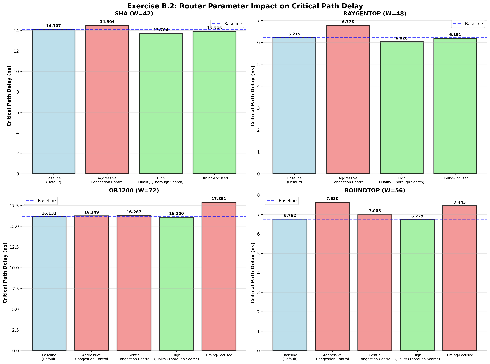

# Exercise 1

Lang Sun
1003584971

# A.1


# A.2



### Results

| Circuit   | Mean   | Std Dev | CV (%) | Min    | Max    |
| --------- | ------ | ------- | ------ | ------ | ------ |
| sha       | 143.33 | 3.71    | 2.59   | 137.51 | 147.73 |
| raygentop | 192.85 | 3.17    | 1.64   | 187.75 | 195.84 |
| or1200    | 343.02 | 2.77    | 0.81   | 339.58 | 346.46 |
| boundtop  | 198.98 | 5.08    | 2.55   | 192.12 | 206.28 |

### Sensitivity to Random Seed

- **SHA**: low (stable) - CV = 2.59%
- **RAYGENTOP**: low (stable) - CV = 1.64%
- **OR1200**: very low (highly stable) - CV = 0.81%
- **BOUNDTOP**: low (stable) - CV = 2.55%

Not all circuits have the same value of sensitivity to random seeds, but they are fairly similar and all show low sensitivity to random seeds. the small might just be noise rather than a real effect.

# A.3

### Results

| Circuit       | Temperature | Mean Cost | Std Dev | CV (%) |
| ------------- | ----------- | --------- | ------- | ------ |
| **sha**       | 100.000000  | 147.90    | 6.74    | 4.56   |
|               | 1.000000    | 143.29    | 2.52    | 1.76   |
|               | 0.010000    | 145.57    | 4.45    | 3.06   |
|               | 0.000100    | 159.65    | 3.45    | 2.16   |
|               | 0.000001    | 168.50    | 4.10    | 2.43   |
| **raygentop** | 100.000000  | 200.39    | 2.15    | 1.07   |
|               | 1.000000    | 200.66    | 4.19    | 2.09   |
|               | 0.010000    | 202.38    | 3.01    | 1.49   |
|               | 0.000100    | 216.47    | 4.67    | 2.16   |
|               | 0.000001    | 229.04    | 4.38    | 1.91   |
| **or1200**    | 100.000000  | 360.89    | 3.60    | 1.00   |
|               | 1.000000    | 359.41    | 5.87    | 1.63   |
|               | 0.010000    | 362.11    | 3.78    | 1.05   |
|               | 0.000100    | 378.86    | 7.26    | 1.92   |
|               | 0.000001    | 401.93    | 7.86    | 1.96   |
| **boundtop**  | 100.000000  | 206.20    | 4.64    | 2.25   |
|               | 1.000000    | 205.22    | 3.82    | 1.86   |
|               | 0.010000    | 204.09    | 5.11    | 2.51   |
|               | 0.000100    | 219.65    | 7.74    | 3.53   |
|               | 0.000001    | 242.20    | 11.03   | 4.55   |



- **SHA**:
  Best:  T =   1.000000 → Cost =  143.29
  Worst: T =   0.000001 → Cost =  168.50
  Degradation:  17.6% (worst vs best)

- **RAYGENTOP**:
  Best:  T = 100.000000 → Cost =  200.39
  Worst: T =   0.000001 → Cost =  229.04
  Degradation:  14.3%

- **OR1200**:
  Best:  T =   1.000000 → Cost =  359.41
  Worst: T =   0.000001 → Cost =  401.93
  Degradation:  11.8% 

- **BOUNDTOP**:
  Best:  T =   0.010000 → Cost =  204.09
  Worst: T =   0.000001 → Cost =  242.20
  Degradation:  18.7%

Very low starting temperatures (<0.001) cause significant quality degradation (12-19%) across ALL circuits

# A.4

For adding the temperature bumpup strategy, in simulated_annealing.cpp, modify
```cpp
    if (t < t_exit || std::isnan(t_exit)) {
        return false;
    }
```
to
```cpp
    if (t < t_exit || std::isnan(t_exit)) {
        // A.4: Temperature bump-up
        static int bump_count = 0;
        if (bump_count < 3) {  // Allow 3 bumps
            t *= 100;  // reheat by a factor of 100
            bump_count++;
            return true;  // keep annealing
        }
        return false;  // stop after 3 bumps
    }
```
### Results

| Circuit   | Mean   | Std Dev | CV (%) | Min    | Max    |
| --------- | ------ | ------- | ------ | ------ | ------ |
| sha       | 137.82 | 6.36    | 4.61   | 127.58 | 144.83 |
| raygentop | 187.49 | 3.57    | 1.90   | 181.41 | 190.62 |
| or1200    | 336.08 | 3.56    | 1.06   | 332.08 | 341.42 |
| boundtop  | 194.61 | 5.29    | 2.72   | 188.15 | 202.80 |

### Comparison to QA.2

| Circuit   | A.2 Mean | A.4 Mean | Improvement | Result |
| --------- | -------- | -------- | ----------- | ------ |
| SHA       | 143.33   | 137.82   | 3.8%        | BETTER |
| RAYGENTOP | 192.85   | 187.49   | 2.8%        | BETTER |
| OR1200    | 343.02   | 336.08   | 2.0%        | BETTER |
| BOUNDTOP  | 198.98   | 194.61   | 2.2%        | BETTER |



**AVERAGE IMPROVEMENT: 2.7%**

Thus, the temperature bump-up strategy DOES improve the final placement cost across all circuits tested.

# B.1

| Circuit   | W   | Mean Delay (ns) | Std Dev (ns) | CV (%) | Success Rate |
| --------- | --- | --------------- | ------------ | ------ | ------------ |
| SHA       | 42  | 14.1406         | 0.3956       | 2.80   | 4/5          |
| RAYGENTOP | 48  | 6.2233          | 0.0487       | 0.78   | 4/5          |
| OR1200    | 72  | 16.2146         | 0.6776       | 4.18   | 5/5          |
| BOUNDTOP  | 56  | 6.6604          | 0.2431       | 3.65   | 5/5          |

**Failed routes:**
- **sha** seed 1000
- **raygentop** seed 1000



- Different placer seeds → different placements → different routing delays
- Very low variation indicates router is actually robust to placement changes

# B.2

Tests **5 router configurations** on all 4 circuits:

1. Baseline - VPR defaults (pres_fac_mult=2.0, acc_fac=1.0, astar_fac=1.2)
2. aggressive Congestion - High penalties (pres_fac_mult=3.0, acc_fac=2.0)
   - *Forces router to avoid congestion strongly*
3. Gentle Congestion - Low penalties (pres_fac_mult=1.5, acc_fac=0.5)
   - *More relaxed about sharing resources*
4. High Quality - Thorough search (astar_fac=0.5, max_iterations=100)
   - *Takes longer but searches harder*
5. Timing-Focused - Balanced approach (astar_fac=0.8, acc_fac=1.5)
   - *Tries to balance timing and congestion*

### Raw Results by Configuration

| Configuration                  | SHA (W=42) | RAYGENTOP (W=48) | OR1200 (W=72) | BOUNDTOP (W=56) |
| ------------------------------ | ---------- | ---------------- | ------------- | --------------- |
| Baseline (Default)             | 14.1073 ns | 6.2150 ns        | 16.1316 ns    | 6.7622 ns       |
| Aggressive Congestion Control  | 14.5036 ns | 6.7781 ns        | 16.2494 ns    | 7.6297 ns       |
| Gentle Congestion Control      | Unroutable | Unroutable       | 16.2867 ns    | 7.0050 ns       |
| High Quality (Thorough Search) | 13.7040 ns | 6.0276 ns        | 16.0999 ns    | 6.7295 ns       |
| Timing-Focused                 | 13.9058 ns | 6.1907 ns        | 17.8910 ns    | 7.4426 ns       |

### Results Summary - Parameter Impact on Critical Path Delay

**SHA:**

| Configuration                  | Delay (ns) | vs Baseline |
| ------------------------------ | ---------- | ----------- |
| Baseline (Default)             | 14.1073    | (reference) |
| Aggressive Congestion Control  | 14.5036    | ↑2.81%      |
| High Quality (Thorough Search) | 13.7040    | ↓2.86%      |
| Timing-Focused                 | 13.9058    | ↓1.43%      |

**RAYGENTOP:**

| Configuration                  | Delay (ns) | vs Baseline |
| ------------------------------ | ---------- | ----------- |
| Baseline (Default)             | 6.2150     | (reference) |
| Aggressive Congestion Control  | 6.7781     | ↑9.06%      |
| High Quality (Thorough Search) | 6.0276     | ↓3.02%      |
| Timing-Focused                 | 6.1907     | ↓0.39%      |

**OR1200:**

| Configuration                  | Delay (ns) | vs Baseline |
| ------------------------------ | ---------- | ----------- |
| Baseline (Default)             | 16.1316    | (reference) |
| Aggressive Congestion Control  | 16.2494    | ↑0.73%      |
| Gentle Congestion Control      | 16.2867    | ↑0.96%      |
| High Quality (Thorough Search) | 16.0999    | ↓0.20%      |
| Timing-Focused                 | 17.8910    | ↑10.91%     |

**BOUNDTOP:**

| Configuration                  | Delay (ns) | vs Baseline |
| ------------------------------ | ---------- | ----------- |
| Baseline (Default)             | 6.7622     | (reference) |
| Aggressive Congestion Control  | 7.6297     | ↑12.83%     |
| Gentle Congestion Control      | 7.0050     | ↑3.59%      |
| High Quality (Thorough Search) | 6.7295     | ↓0.48%      |
| Timing-Focused                 | 7.4426     | ↑10.06%     |




1. **High Quality** (2-3% better)
   - Lower `astar_fac` = more thorough search
   - Finds near-optimal paths
   - Router search depth matters

2. **Aggressive Congestion** (up to 12.8% worse)
   - High penalties → long detours → bad timing
   - In lecture 3: High pn and hn force router away from congestion, but at cost of delay

3. **Gentle Congestion** (Some circuits unroutable)
   - Too permissive → can't resolve shorts
   - SHA/RAYGENTOP at borderline W → routing failure
   - Need penalties aggressive enough to converge

4. **Timing-Focused** (mixed)
   - Good on small circuits, terrible on large
   - Parameters don't generalize well

The High Quality configuration achieved the best results by using a lower A* search factor (astar_fac=0.5), improving timing by up to 3%. Conversely, Aggressive Congestion Control worsened timing by up to 12.8% because high penalties (pres_fac_mult=3.0, acc_fac=2.0) forced the router to take longer detours to avoid congestion. This demonstrates PathFinder's fundamental trade-off, which is that aggressive congestion penalties resolve shorts faster but sacrifice path optimality.

# B.3

| Circuit   | W  | Mean Delay (ns) | Std Dev (ns) | CV (%) | Success Rate |
|-----------|----|-----------------|--------------|--------|--------------|
| SHA       | 42 | 13.9035         | 0.2615       | 1.88   | 5/5          |
| RAYGENTOP | 48 | 6.3306          | 0.0983       | 1.55   | 4/5          |
| OR1200    | 72 | 16.3212         | 0.4198       | 2.57   | 5/5          |
| BOUNDTOP  | 56 | 6.6946          | 0.2071       | 3.09   | 5/5          |

**Failed routes:**
- **raygentop** seed 1000

### Comparison to B.1 - Impact of Routing Order

| Circuit   | B.1 Normal (ns) | Std Dev | B.3 Reversed (ns) | Std Dev | Difference | Impact  |
|-----------|-----------------|---------|-------------------|---------|------------|---------|
| SHA       | 14.0942         | 0.3579  | 13.9035           | 0.2615  | ↓1.35%     | BETTER  |
| RAYGENTOP | 6.0525          | 0.3842  | 6.1384            | 0.4382  | ↑1.42%     | WORSE   |
| OR1200    | 16.2146         | 0.6776  | 16.3212           | 0.4198  | ↑0.66%     | WORSE   |
| BOUNDTOP  | 6.6604          | 0.2431  | 6.6946            | 0.2071  | ↑0.51%     | WORSE   |

**Average Impact: 0.31% worse with reversed routing order**

Routing order has minimal impact on final timing (<1.5% variation). PathFinder's negotiated congestion resolution makes it relatively insensitive to net ordering. Maybe this is just noise rather than a real effect.