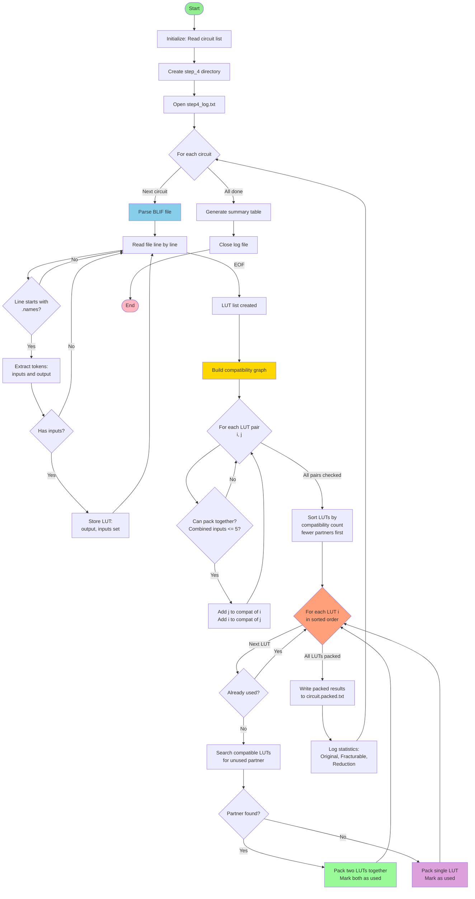

# ECE 1387 – Exercise 2

Lang Sun
1003584971

## 1.

| Circuit | # of LUTs | Depth (levels) |
| ------- | --------- | -------------- |
| alu4    | 850       | 6              |
| clma    | 3464      | 10             |
| div     | 9919      | 858            |
| misex3  | 803       | 5              |
| sqrt    | 4409      | 1005           |

## 2.

| Circuit | Step 1 LUTs | Step 1 Depth | Step 2 LUTs | Step 2 Depth | Area Change    | Depth Change  |
| ------- | ----------- | ------------ | ----------- | ------------ | -------------- | ------------- |
| alu4    | 850         | 6            | 815         | 12           | -35 (-4.1%)    | +6 (+100%)    |
| clma    | 3464        | 10           | 2991        | 19           | -473 (-13.7%)  | +9 (+90%)     |
| div     | 9919        | 858          | 8197        | 2060         | -1722 (-17.4%) | +1202 (+140%) |
| misex3  | 803         | 5            | 754         | 10           | -49 (-6.1%)    | +5 (+100%)    |
| sqrt    | 4409        | 1005         | 5127        | 2216         | +718 (+16.3%)  | +1211 (+120%) |

- Area: On average, area optimization reduced LUT count by 8.0% (1,561 fewer LUTs)
- Depth: Depth increased significantly (~100-140%) across all circuits, which make sense since this is optimizing for area instead of depth
- exception: sqrt increased in LUT count by 16.3%, showing that area optimization doesn't always reduce area for all circuits

## 3.

| Circuit | Step 1 (resyn2 x1) LUTs | Step 1 Depth | Step 3 (resyn2 x3) LUTs | Step 3 Depth | LUT Change    | Depth Change |
| ------- | ----------------------- | ------------ | ----------------------- | ------------ | ------------- | ------------ |
| alu4    | 850                     | 6            | 872                     | 5            | +22 (+2.6%)   | -1 (-16.7%)  |
| clma    | 3464                    | 10           | 3101                    | 10           | -363 (-10.5%) | 0 (0%)       |
| div     | 9919                    | 858          | 9889                    | 858          | -30 (-0.3%)   | 0 (0%)       |
| misex3  | 803                     | 5            | 787                     | 5            | -16 (-2.0%)   | 0 (0%)       |
| sqrt    | 4409                    | 1005         | 4528                    | 1005         | +119 (+2.7%)  | 0 (0%)       |

- LUT: 
  - clma showed significant improvement (-10.5%)
  - alu4 and sqrt actually increased in LUT count
  - div and misex3 showed minimal change
- Depth: Mostly unchanged, with only alu4 improving by 1 level
- Multiple resyn2 calls can help in some cases (like clma), but the improvement is circuit-dependent and not consistently beneficial.

## 4.

### Algorithm Description

1. **Parse BLIF**: Extract each LUT's output name and input signals from the area-optimized mapping (Step 2)

2. **Check Compatibility**: For each pair of LUTs, check if they can be packed together:
   - Compute union of their input sets
   - Compatible if combined unique inputs ≤ 5

3. **Packing**:
   - Sort LUTs by compatibility count (ascending order)
   - Prioritize hard-to-pack LUTs (those with fewer compatible partners)
   - For each LUT: pair with compatible partner if available, otherwise pack alone

4. **Output Format**: One line per fracturable LUT:
   - Single LUT: `output_name`
   - Paired LUTs: `output_name1 output_name2`

### Results

| Circuit | Original LUTs | Fracturable LUTs | Paired | Single | Reduction | Reduction % |
| ------- | ------------- | ---------------- | ------ | ------ | --------- | ----------- |
| alu4    | 815           | 625              | 190    | 435    | 190       | 23.3%       |
| clma    | 2977          | 2244             | 733    | 1511   | 733       | 24.6%       |
| div     | 8197          | 4246             | 3951   | 295    | 3951      | 48.2%       |
| misex3  | 754           | 589              | 165    | 424    | 165       | 21.9%       |
| sqrt    | 5127          | 2716             | 2411   | 305    | 2411      | 47.0%       |

## 5.

| Circuit | Area      | Delay    | Levels |
| ------- | --------- | -------- | ------ |
| alu4    | 4,578.00  | 12.90    | 12     |
| clma    | 17,402.00 | 30.60    | 26     |
| div     | 86,404.00 | 3,440.36 | 2,237  |
| misex3  | 4,139.00  | 11.80    | 11     |
| sqrt    | 39,155.00 | 4,170.78 | 3,884  |

## 6.

| Circuit | Step 5 Area (Full) | Step 6 Area (Minimal) | Area Increase | Step 5 Delay | Step 6 Delay | Delay Increase | Step 5 Levels | Step 6 Levels |
| ------- | ------------------ | --------------------- | ------------- | ------------ | ------------ | -------------- | ------------- | ------------- |
| alu4    | 4,578.00           | 6,075.00              | +32.7%        | 12.90        | 23.80        | +84.5%         | 12            | 25            |
| clma    | 17,402.00          | 22,289.00             | +28.1%        | 30.60        | 55.00        | +79.7%         | 26            | 57            |
| div     | 86,404.00          | 97,950.00             | +13.4%        | 3,440.36     | 4,535.29     | +31.8%         | 2,237         | 4,555         |
| misex3  | 4,139.00           | 5,500.00              | +32.9%        | 11.80        | 21.90        | +85.6%         | 11            | 23            |
| sqrt    | 39,155.00          | 47,284.00             | +20.8%        | 4,170.78     | 5,970.54     | +43.2%         | 3,884         | 6,082         |

## 7.

| Circuit | Step 1 LUTs (Depth) | Step 2 LUTs (Area) | NAND-Equiv | Gates/LUT (S1) | Gates/LUT (S2) |
| ------- | ------------------- | ------------------ | ---------- | -------------- | -------------- |
| alu4    | 850                 | 815                | 3,037.5    | 3.57           | 3.73           |
| clma    | 3,464               | 2,991              | 11,144.5   | 3.22           | 3.73           |
| div     | 9,919               | 8,197              | 48,975.0   | 4.94           | 5.97           |
| misex3  | 803                 | 754                | 2,750.0    | 3.42           | 3.65           |
| sqrt    | 4,409               | 5,127              | 23,642.0   | 5.36           | 4.61           |

- Average NAND-gate-equivalents per LUT:
  - Step 1 (depth-optimized): 4.61 gates/LUT
  - Step 2 (area-optimized): 5.01 gates/LUT

1. Area optimization generally reduces LUT count, except for sqrt

2. NAND-gates per LUT ratio (3.2 - 5.97)
   - This makes sense since A 6-LUT can implement complex functions
   - NAND gates are only 2-input, so need multiple to match a LUT

3. complexity
   - More complex circuits pack more logic into each LUT

The fact that a 6-LUT to replace ~5 NAND gates kinda shows why LUT-based FPGAs are efficient for implementing arbitrary logic functions